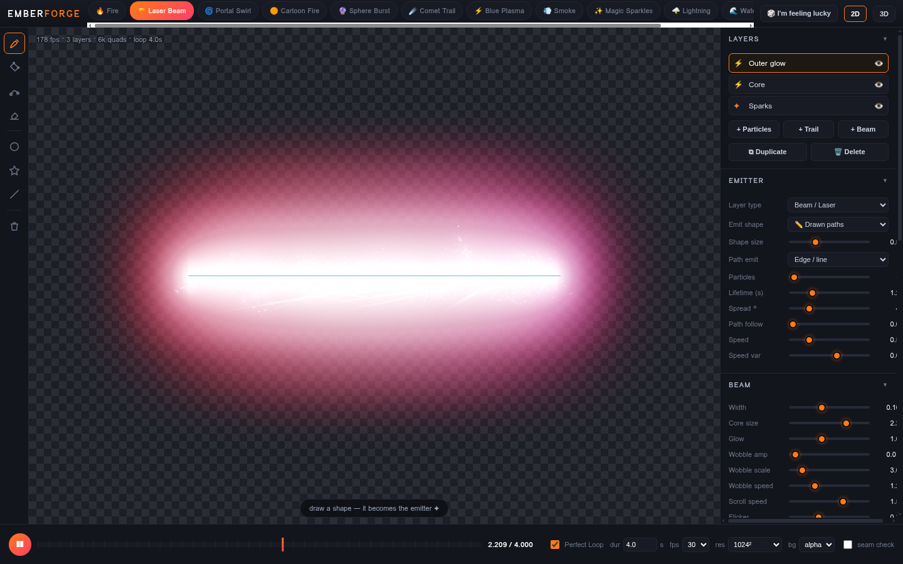
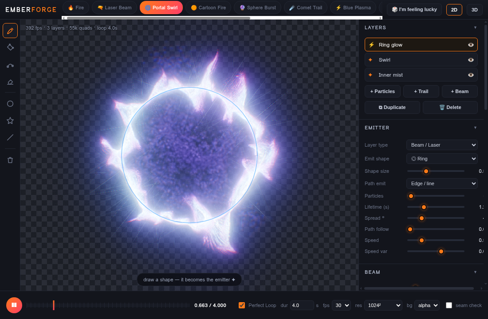
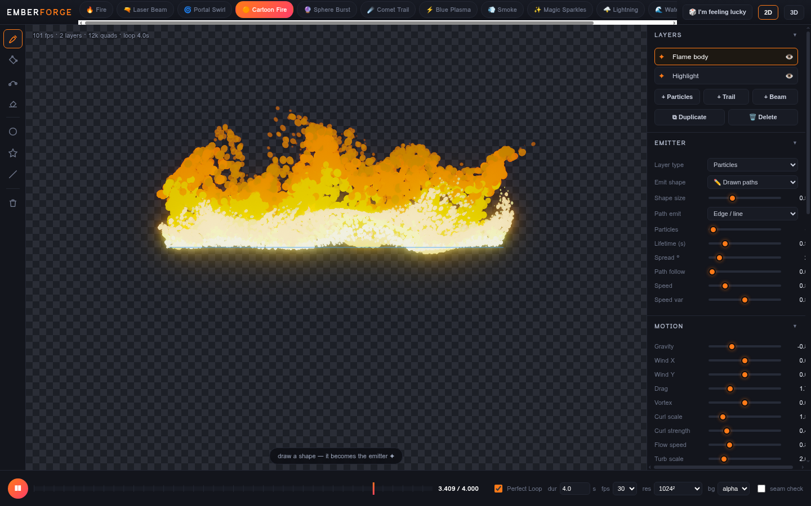

# 🔥 EMBERFORGE

**Draw a shape → get studio-grade VFX.** A single-file, GPU-powered VFX studio that runs in any modern browser. No install, no dependencies, no build step — just open `index.html`.

**▶ Live:** https://raw.githack.com/RopoFlow/projectred/main/emberforge/index.html

## ✨ What it does

Draw any path / shape on the canvas (freehand, polygon, circle, star, line…) and EMBERFORGE turns it into a real-time particle effect rendered with WebGL2: HDR bloom, ACES tonemapping, chromatic aberration, film grain — the whole cinematic stack.

## 🧱 Layer system (V2)

Effects are composed from stackable layers, like After Effects:

| Layer type | What it gives you |
|---|---|
| **Particles** | classic GPU particles (up to 200k), curl noise, turbulence, vortex, trails |
| **Trail** | a travelling head that runs along your drawn path, leaving a tail |
| **Beam / Laser** | continuous beam with core + glow, wobble, scroll, flicker, taper |

Each layer has its **own color gradient, blend mode, emitter shape and full slider set**. Add / duplicate / hide / delete layers from the LAYERS panel.

**3D emitter shapes:** drawn paths · point burst · fountain · sphere surface · sphere volume · ring — plus a 3D orbit mode (drag to orbit, wheel to zoom).

**Cartoon mode:** posterize + hard alpha cutoff for stylized / cel-shaded effects (see 🟠 Cartoon Fire).

 

## 🎛 Presets

🔥 Fire · 🔫 Laser Beam · 🌀 Portal Swirl · 🟠 Cartoon Fire · 🔮 Sphere Burst · ☄️ Comet Trail · ⚡ Blue Plasma · 💨 Smoke · ✨ Magic Sparkles · 🌩 Lightning · 🌊 Waterfall Mist · 🕳 Black Hole — all built from multiple layers you can open up and tweak. Plus **I'm feeling lucky** randomization.

## 🔁 Perfect loops

Particles are a *pure function of time* (stateless GPU simulation), so loops are mathematically seamless at any exact duration (e.g. 4.000s). Scrub the timeline freely; use **seam check** to visually verify first vs last frame.

## 📦 Export (all client-side, no server)

- **PNG sequence with alpha** (zip) — for game engines / compositing
- **WebM with alpha** (VP9, via WebCodecs)
- **MP4** (H.264)
- **GIF**
- **Flipbook sprite sheet** + ready-made Unity & Roblox usage notes (incl. `RobloxFlipbook.lua`)
- **Still PNG** · **Scene save/load** (.json, includes all layers)

Resolutions up to 4K, 24/30/60 fps.

## 🚀 Run it

Open `index.html` in Chrome / Edge / Firefox (Windows, Mac, Linux). That's it.

> Built by Viktor 🤖
